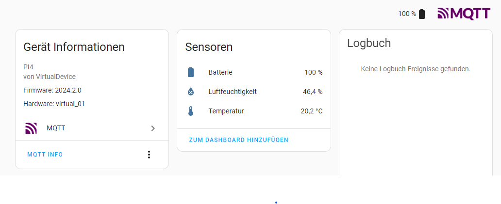

# datalogger

This is a companion script to [GoveeBTTempLogger](https://github.com/wcbonner/GoveeBTTempLogger). to provide an integration to homeassistant, using MQTT, including the automatic creation of HA entities via MQTT device discovery  





**Filemonitor** watching a directory and on changes to a (log-)file gets the last line, reformats it as json, then publishes that json as payload to an MQTT Topic

When a device is encountered for the first time, a Homeassitant MQQT Sensor configuration topic is sent to HA. 
The Sensor is configred based on a template stored in the config_template.json file

All parameters are stored in the config.json file

This script uses the **Eclipse paho** mqtt client library to communicate with the MQTT Broker, as well as the **watchdog** library to monitor file system changes.
Both need to be installed using pip:
   >`pip install watchdog paho-mqtt`

For more details see:  

   [MQTT Sensor](https://www.home-assistant.io/integrations/sensor.mqtt/)

   [MQTT Integration - Sensors](Mhttps://www.home-assistant.io/integrations/mqtt/#sensors)


## Configuration File

the script reads some parameters from `config.json` :  

```
{
    "mqtt_broker": "<<hostname or ip of your MQTT Broker (homeassistant server)>>",
    "mqtt_port": <<MQTT Port, default is 1883>>,
    "monitoring_dir": "<<Directory where GoveeTempLogger stores the logfiles, defualt: /var/log/goveebttemplogger",
    "filename_regex": "Regular expression pattern used to select the files to watch as well as to extract the deviceID. Default: gvh-(.+)-.+-.+.txt",
    "mqtt_username": "Homeassistant user , used to log on to theMQTT Broker. Default: datalogger",
    "mqtt_password": "Password to login to MQTT Broker,default: datalogger2024",
    "mqtt_topic": "Pefix for the MQTT Topic to use. When using standard Device Discovery this must be: homeassistant/sensor",
    "tracked_devices": [<<Empty ... Will be filled by the script as devices are discoverd. If you want to re-discover devices, simply delete the items from tis list>>]
}

```

## Device Configuration Template

to dynamically configure the Homeassistant devices, when GoveeTempLogger finds a new device, there is a template file `config_template.json` Where the HA configuration is defined. The default template below, defines one device identified as "##DeviceId##", where the string "##DeviceId##" will be replaced with the actual device id discoverd (See filename_regex parameter above). This device will have three attributes: Temparture, Humidity and Battery.

```json
{
    "temperature": {
        "device_class": "temperature",
        "state_topic": "homeassistant/sensor/##DeviceId##/state",
        "unit_of_measurement": "°C",
        "value_template": "{{ value_json.temperature}}",
        "unique_id": "temp_##DeviceId##",
        "device": {
            "identifiers": [
                "##DeviceId##"
            ],
            "name": "Datalogger_##DeviceId##",
            "manufacturer": "VirtualDevice",
            "model": "PI4",
            "hw_version": "virtual_01",
            "sw_version": "2024.2.0"
        }
    },
    "humidity": {
        "device_class": "humidity",
        "state_topic": "homeassistant/sensor/##DeviceId##/state",
        "unit_of_measurement": "%",
        "value_template": "{{ value_json.humidity}}",
        "unique_id": "hum_##DeviceId##",
        "device": {
            "identifiers": [
                "##DeviceId##"
            ]
        }
    },
    "battery": {
        "device_class": "battery",
        "state_topic": "homeassistant/sensor/##DeviceId##/state",
        "unit_of_measurement": "%",
        "value_template": "{{ value_json.battery}}",
        "unique_id": "bat_##DeviceId##",
        "device": {
            "identifiers": [
                "##DeviceId##"
            ]
        }
    }
}
```


## Run as a service on Raspberry PI

To package your Python script as a service on a Raspberry Pi running Raspberry Pi OS (a Debian-based Linux distribution), you can create a systemd service unit. This approach allows the script to run as a background service that starts automatically on boot, and can be controlled with standard `systemctl` commands.

Here's a step-by-step guide to achieve this:

### Step 1: Create a Python Virtual Environment

1. Navigate to your script's directory:

   ```bash
   cd /path/to/your/script
   ```

2. Create a virtual environment:

   ```bash
   python3 -m venv .venv
   ```

3. Activate the virtual environment:

   ```bash
   source .venv/bin/activate
   ```

4. Install required modules within the virtual environment:

   ```bash
   pip install watchdog paho-mqtt # and any other modules you need
   ```

### Step 2: Create a systemd Service File

1. Create a new service file in `/etc/systemd/system/`. For example, `yourscript.service`:

   ```bash
   sudo nano /etc/systemd/system/yourscript.service
   ```

2. Add the following content to the service file:

   ```ini
   [Unit]
   Description=Your Python Script Service
   After=network.target

   [Service]
   Type=simple
   User=pi
   WorkingDirectory=/path/to/your/script
   ExecStart=/path/to/your/script/.venv/bin/python /path/to/your/script/your_script.py

   [Install]
   WantedBy=multi-user.target
   ```

   Replace `/path/to/your/script` and `your_script.py` with the actual path and name of your script.

### Step 3: Enable and Start the Service

1. Reload the systemd manager configuration:

   ```bash
   sudo systemctl daemon-reload
   ```

2. Enable the service to start on boot:

   ```bash
   sudo systemctl enable yourscript.service
   ```

3. Start the service:

   ```bash
   sudo systemctl start yourscript.service
   ```

### Step 4: Managing the Service

- Check the status of your service:

  ```bash
  sudo systemctl status yourscript.service
  ```

- To stop the service:

  ```bash
  sudo systemctl stop yourscript.service
  ```

- To restart the service:

  ```bash
  sudo systemctl restart yourscript.service
  ```

### Additional Notes

- **User**: Ensure that the `User` field in the service file is set to a user with appropriate permissions. I used `pi` as it is the default user on Raspberry Pi OS.
- **Logging**: Systemd will handle logging for your service. You can view logs using `journalctl -u yourscript.service`.
- **Environment Variables**: If your script requires environment variables, you can set them in the service file under the `[Service]` section using `Environment=` directives.
- **Running from the Command Line**: To run your script from the command line, just activate the virtual environment and run the script as usual.

By following these steps, your Python script will be set up as a systemd service on your Raspberry Pi, ensuring it runs in the background and starts automatically on boot.


## License: 

**Unlicense**.  
For more information, please refer to [unlicense.org](http://unlicense.org/)


## Disclaimer

**YMMV** : Your Milage My Vary!


Version 0.8 - February 2024